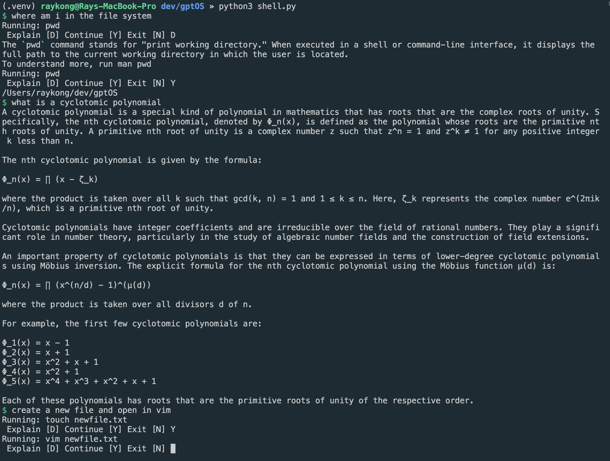

## ShellGPT
A shell that supports general inquiries, and conversion of natural language commands to bash commands:

## Getting Started

- run ``export OPENAI_API_KEY = "<your-api-key>"``
- Install dependency: ``pip3 install requirements.txt``
- Start the shell by running ``python3 shell.py``
